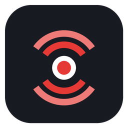
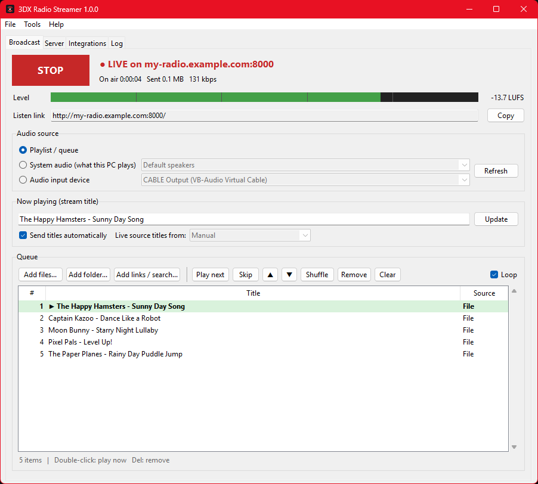
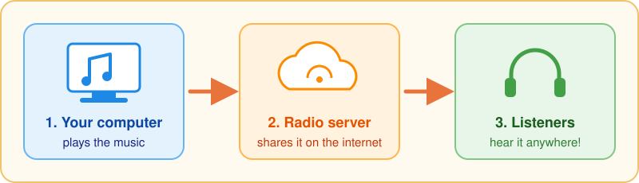
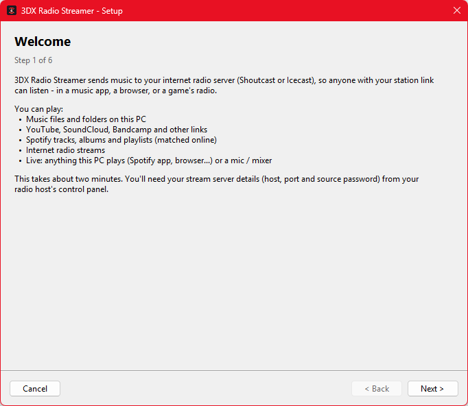
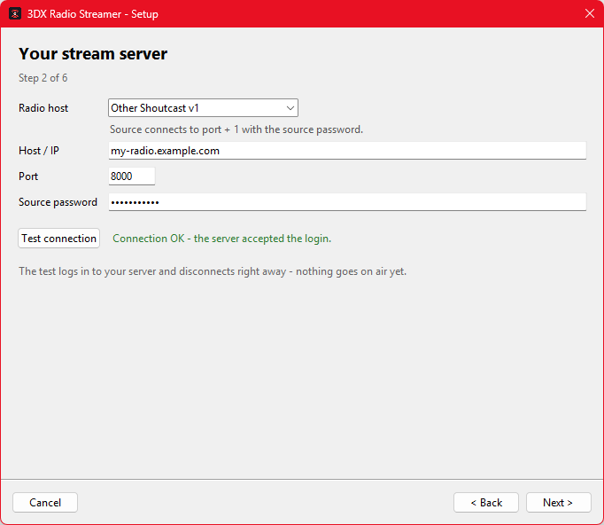
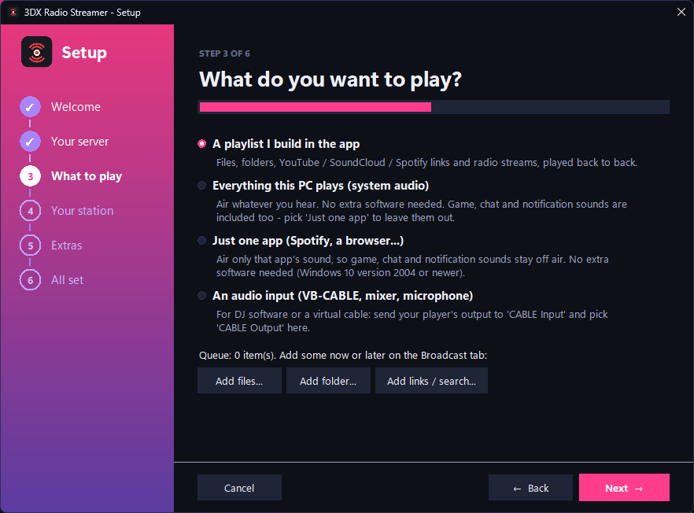
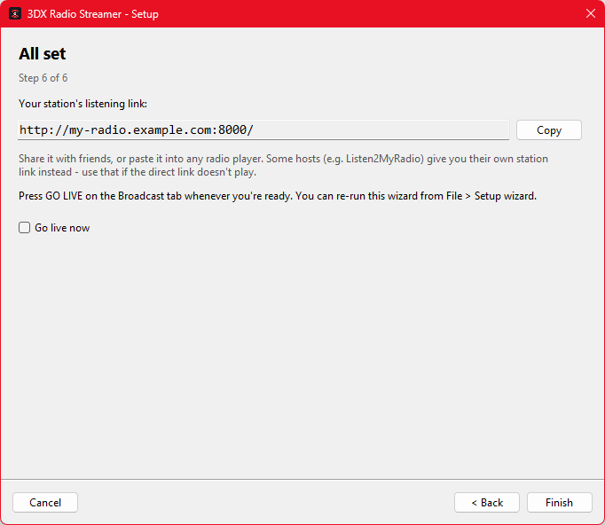
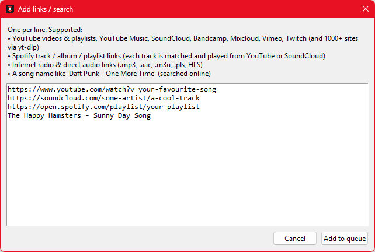
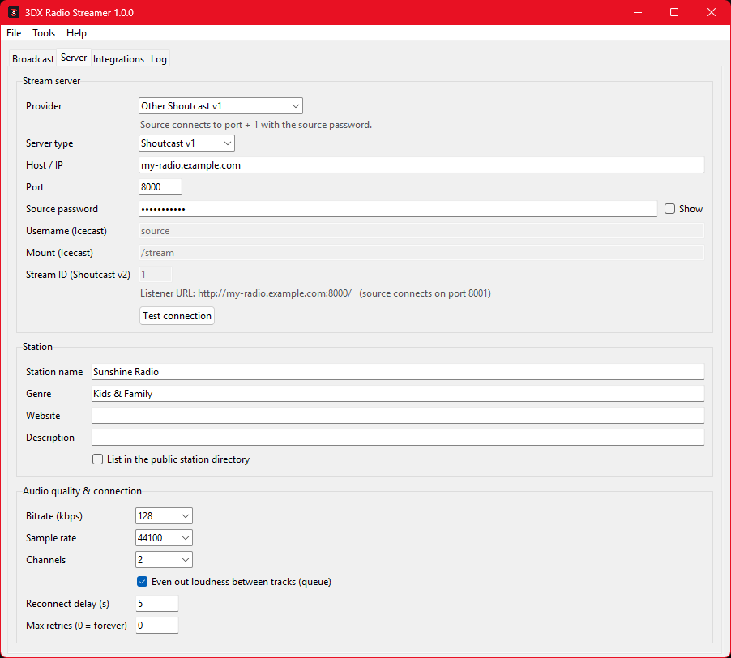

<p align="center">
  
</p>

<h1 align="center">3DX Radio Streamer</h1>

<p align="center">
  <b>Start your very own internet radio station!</b><br>
  Pick your music, press one big button, and friends anywhere can listen. 🎶
</p>

<p align="center">
  <a href="https://github.com/Deaeath/3dx-radio-streamer/releases/latest"></a>
  <a href="LICENSE"></a>
  
</p>

<p align="center">
  
</p>

---

## 📻 How does it work?

<p align="center">
  
</p>

Your computer plays the music. A **radio server** passes it along on the internet. Anyone
with your **listen link** can tune in from a music app, a web browser, or a game's radio.

## 🎵 What can I play?

| | |
|---|---|
| 📁 **Songs on your computer** | MP3, WAV, FLAC, and lots more. Even the sound from video files! |
| ▶️ **YouTube & SoundCloud** | Paste a link to a song or a whole playlist |
| 💚 **Spotify playlists** | Paste the link and each song is found online for you |
| 📡 **Other radio stations** | Paste the station's link |
| 🔎 **A song name** | Just type it, like `The Happy Hamsters - Sunny Day Song` |
| 🎧 **Whatever your computer is playing** | Share the music from any app, live |
| 🎯 **Just one app** | Share only Spotify or your browser, so game and chat sounds stay off air |

---

## 🚀 Let's get started!

> 👋 **New to this?** Steps 1 and 2 involve downloading an app and signing up for a
> website. After that, everything happens inside the app.

### Step 1: Download the app

Go to the **[download page](https://github.com/Deaeath/3dx-radio-streamer/releases/latest)**
and pick one:

| Download | What it is |
|---|---|
| ⭐ `...-setup.exe` | **The easiest choice.** Installs the app like any other program |
| `...-portable.zip` | Unzip it and run it from any folder, even a USB stick |
| `...-standalone.exe` | One single file. Double-click it and go! |

Everything the app needs is already inside, so there's nothing else to install.

> 🛡️ Windows might say *"Windows protected your PC"*. That's because the app is brand new.
> Click **More info**, then **Run anyway**.

### Step 2: Choose where your station lives

**The easy way: Host it myself.** It's the app's default. There's no account, nothing to copy and no
router settings: when you press GO LIVE, the app gives you a free public link (`https://...trycloudflare.com`)
to paste into your room radio or share with friends. Listeners connect to your PC, so each one uses about
0.13 Mbps of your upload. The link changes each time you go live.

Prefer a fixed link? Pick **Direct** under *Host on this PC* (it asks your router to open the port; this
doesn't work on a VPN), or use a radio host like **[Listen2MyRadio](https://newl2mr.listen2myradio.com/signup)**.
For Listen2MyRadio, sign up, open the
**[control panel](https://newl2mr.listen2myradio.com/control-panel)** and look under
**Stream Details** for three things you'll need:

- 🏠 the **Hostname** (the server's address)
- 🔢 the **Port** (a number)
- 🔑 the **Stream Password**

Make sure **Stream Status** says **ON**. If it doesn't, press **Turn ON**.

Using a different host? Pick it in the setup wizard. Zeno.FM, FreeSHOUTcast, Caster.fm and
any Shoutcast or Icecast server work too.

### Step 3: Follow the setup wizard

The first time you open the app, a friendly helper called the **setup wizard** pops up.

<p align="center">
  
</p>

Type in your host, port and password, then press **Test connection**. Green text means
it worked! ✅

<p align="center">
  
</p>

Next, choose what you want to play:

<p align="center">
  
</p>

At the end you get your **listen link**. Press **Copy** and share it with your friends!

<p align="center">
  
</p>

### Step 4: Add some music

Press **+ Files** or **+ Folder** for songs on your computer. Or press the pink
**+ Links / search** button and paste links or type song names, one per line:

<p align="center">
  
</p>

### Step 5: Press GO LIVE! 🔴

Press the big green **GO LIVE** button. It turns red and says **LIVE**. You're on the air! 🎉

- 🟩 The **green bar** bounces when music is playing
- ▶️ The song playing right now is highlighted in the list
- 👆 **Double-click** a song to play it now, or press **Skip** for the next one
- ⏹️ Press **STOP** when you're done

---

## 🤔 Uh oh, something's wrong!

| What you see | What to do |
|---|---|
| *"refused the connection"* | The radio server is switched off. Press **Turn ON** in your radio host's control panel. |
| *"... is not running"* | You picked **One app only**. Start that app first, then press **GO LIVE** again. |
| *"rejected the login"* | The password isn't right. Check it on your radio host's website. |
| The green bar doesn't move | No music is playing. Add songs or press **GO LIVE** again. |
| A YouTube song won't play | Click **Tools → Update yt-dlp**, then try again. |
| *"confirm you're not a bot"* | YouTube is being careful. See the tips in the advanced section below. |

## 💛 Be a good DJ

- 🎵 Only play music you're allowed to share. See **Legal** in the advanced section below.
- 🔑 Keep your source password secret, like any other password.
- 😊 Be kind to your listeners!

---

<details>
<summary><b>🧑‍🔧 For advanced users: more details, settings and building</b></summary>

### Features
- A gapless queue of local files (any format FFmpeg reads, including video), `.m3u` / `.pls` /
  `.xspf` playlists, yt-dlp links (YouTube, SoundCloud, Bandcamp, Mixcloud, Vimeo, Twitch, 1000+
  sites), Spotify links (DRM-protected, so each track is matched on YouTube or SoundCloud),
  internet radio, HLS and direct audio URLs. Loudness is evened out between tracks.
- Live sources: Windows system audio (WASAPI loopback, no virtual cable needed), one app and its
  child processes only (WASAPI process loopback, Windows 10 2004+, no driver needed), or any input
  device (VB-CABLE, a mixer, a microphone). If the chosen app quits mid-broadcast, the stream
  carries silence and picks the app up again when it restarts.
- Shoutcast v1, Shoutcast v2 (DNAS 2) and Icecast 2 / AzuraCast, MP3 at 64–320 kbps, automatic
  reconnect.
- Stream titles from tags, from music-app window titles (Spotify, browsers, VLC, foobar2000,
  Winamp, MusicBee, AIMP), or from a Last.fm user's now playing. Last.fm scrobbling.
- Provider presets (Listen2MyRadio, Zeno.FM, FreeSHOUTcast, Caster.fm, generic) and settings
  import from Mixxx.

### Tips
- **YouTube "confirm you're not a bot"** usually happens on a VPN. Turn the VPN off, or on the
  **Integrations** tab set *YouTube sign-in* to a browser that's signed in to YouTube (Firefox
  works best), or switch song matching to SoundCloud.
- **The stream drops right after connecting:** the bitrate is above the plan's limit. Free plans
  are often 96 kbps; change it on the **Server** tab.
- Shoutcast sources connect on **port + 1**.
- Settings are stored in `%APPDATA%\3DXRadioStreamer\settings.json`. The source password is
  stored there in plain text.
- `"3DX Radio Streamer.exe" --selftest` checks the tools, devices and the whole broadcast
  pipeline.

<p align="center"></p>

### Running from source (Windows / macOS / Linux)
Python 3.9+ with tkinter, and FFmpeg on PATH:
```
pip install -r requirements.txt
python RadioStreamer.py
```
On macOS and Linux, live capture uses an input device (BlackHole on macOS, a PulseAudio
`.monitor` source on Linux). System-audio capture is Windows-only.

### Building a release (Windows)
```
powershell -ExecutionPolicy Bypass -File build\build.ps1
```
This creates `.venv`, downloads an LGPL FFmpeg build and yt-dlp, and builds the one-folder app,
portable zip, standalone exe and (if Inno Setup 6 is installed) the installer. Each build must
pass `--selftest`. To embed a default Last.fm API key, set `LASTFM_API_KEY` and
`LASTFM_API_SECRET` first. `docs\make_screenshots.py` regenerates these pictures with demo data.

### Legal
Only broadcast audio you have the rights to stream. Public internet radio usually needs
performance licences, and downloading from YouTube or other sites may break their terms of
service. Bundled components and their licences are listed in `THIRD-PARTY-NOTICES.md`.

</details>

<p align="center">Made with 💛 · MIT License</p>
